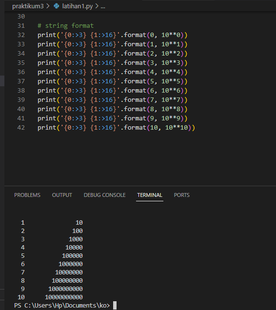
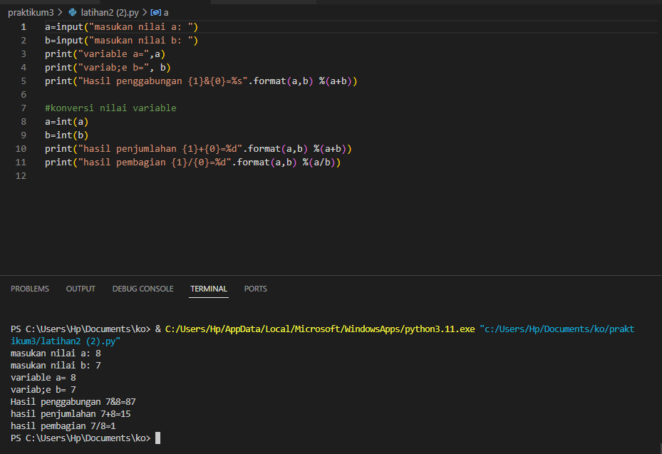
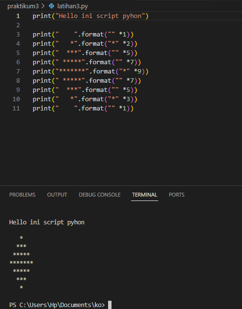
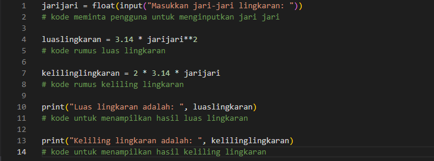
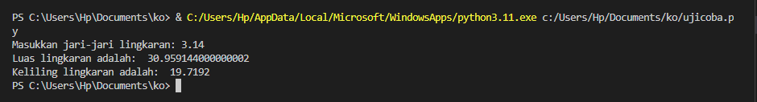

# PRAKTIKUM 3

# installation enviroment virtual (VENV) & deactivate di visual studio code

# Latihan1

# Latihan2

# Latihan3

# Menghitung Luas Dan Keliling Lingkaran Menggunakan python

* membuat kode program untuk menghitung luas dan keliling lingkaran

# Maka Hasilnya

